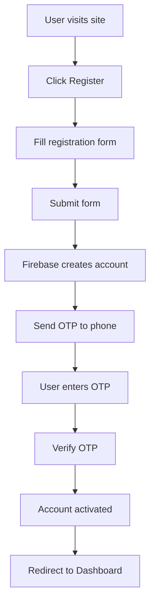
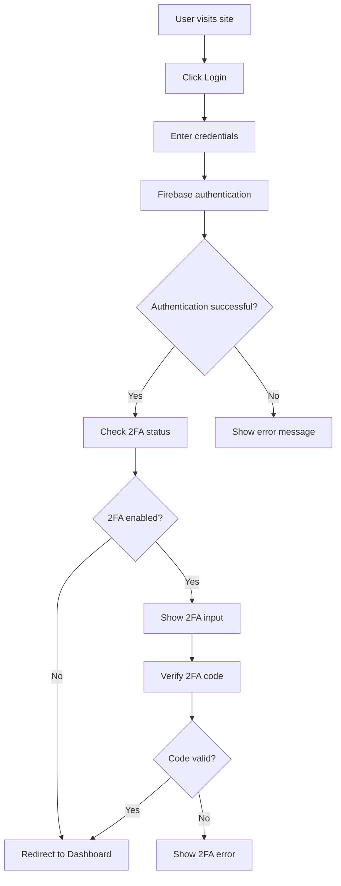
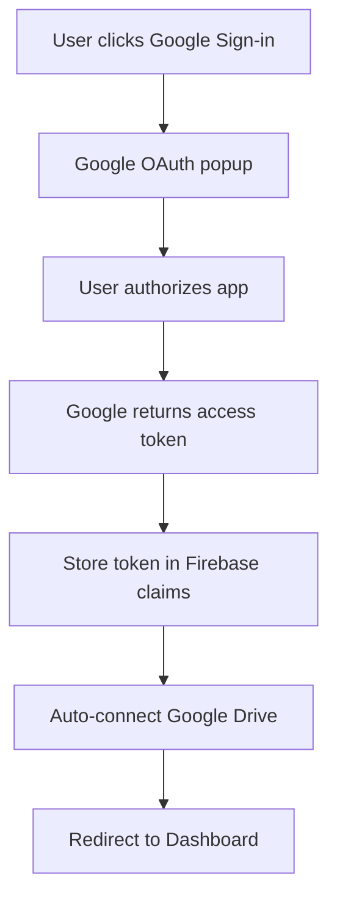
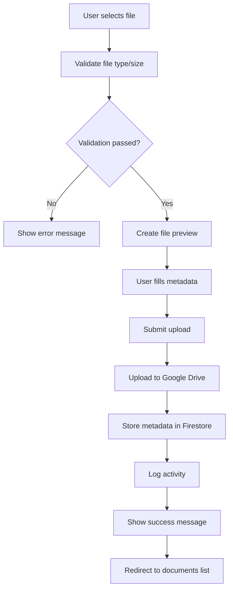
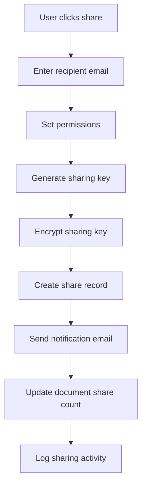
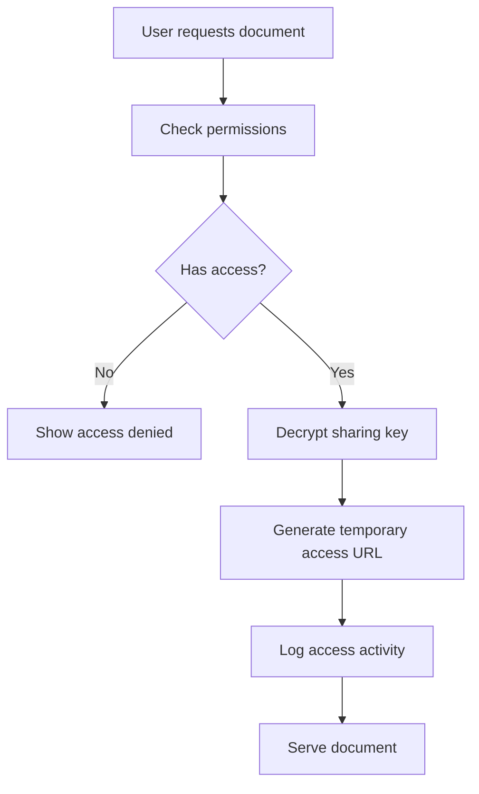

# SecureDocShare - Project Flow Documentation

## 📋 Table of Contents

1. [System Architecture](#system-architecture)
2. [User Journey Flow](#user-journey-flow)
3. [Authentication Flow](#authentication-flow)
4. [Document Management Flow](#document-management-flow)
5. [Sharing Flow](#sharing-flow)
6. [Security Flow](#security-flow)
7. [Data Flow](#data-flow)
8. [Error Handling Flow](#error-handling-flow)

## 🏗️ System Architecture

### **High-Level Architecture**

```
┌─────────────────┐    ┌─────────────────┐    ┌─────────────────┐
│   Frontend      │    │   Backend       │    │   External      │
│   (Next.js)     │◄──►│   (Firebase)    │◄──►│   Services      │
│                 │    │                 │    │                 │
│ • React App     │    │ • Auth          │    │ • Google Drive  │
│ • Components    │    │ • Firestore     │    │ • OAuth 2.0     │
│ • Pages         │    │ • Functions     │    │ • Email         │
│ • Styling       │    │ • Storage       │    │ • SMS           │
└─────────────────┘    └─────────────────┘    └─────────────────┘
```

### **Component Architecture**

```
┌─────────────────────────────────────────────────────────────┐
│                    User Interface Layer                     │
├─────────────────────────────────────────────────────────────┤
│  Pages: Login, Register, Dashboard, Documents, Security   │
├─────────────────────────────────────────────────────────────┤
│                Component Layer                             │
├─────────────────────────────────────────────────────────────┤
│  Components: Navbar, DocumentCard, TwoFactorSetup, etc.   │
├─────────────────────────────────────────────────────────────┤
│                 Service Layer                              │
├─────────────────────────────────────────────────────────────┤
│  Services: Auth, Document, Share, Notification, etc.      │
├─────────────────────────────────────────────────────────────┤
│                 Utility Layer                              │
├─────────────────────────────────────────────────────────────┤
│  Utils: Encryption, Validation, Logging, etc.             │
├─────────────────────────────────────────────────────────────┤
│                 External APIs                              │
├─────────────────────────────────────────────────────────────┤
│  Firebase, Google Drive, Email, SMS                       │
└─────────────────────────────────────────────────────────────┘
```

## 👤 User Journey Flow

### **1. New User Registration Flow**



### **2. Existing User Login Flow**



### **3. Google OAuth Flow**



## 🔐 Authentication Flow

### **JWT Token Flow**

```
1. User Login → Firebase Auth → JWT Token
2. JWT Token → Stored in localStorage
3. API Request → Include JWT in Authorization header
4. Server → Verify JWT with Firebase Admin
5. Server → Extract user info from JWT
6. Server → Process request with user context
```

### **Two-Factor Authentication Flow**

```
1. User enables 2FA → Generate secret key
2. Secret key → Generate QR code
3. User scans QR → Authenticator app stores secret
4. User enters code → Verify with secret
5. 2FA enabled → Store status in user profile
6. Future logins → Require 2FA code
```

## 📄 Document Management Flow

### **Document Upload Flow**



### **Document Sharing Flow**



### **Document Access Flow**



## 🔒 Security Flow

### **Encryption Flow**

```
1. Document → Generate random encryption key
2. Encryption key → Encrypt document content
3. Encrypted document → Upload to Google Drive
4. Encryption key → Encrypt with user's public key
5. Encrypted key → Store in Firestore
6. Document access → Decrypt key → Decrypt document
```

### **Access Control Flow**

```
1. User request → Check authentication
2. Authentication → Check authorization
3. Authorization → Check document ownership
4. Ownership → Check sharing permissions
5. Permissions → Grant/deny access
6. Access → Log activity for audit
```

## 📊 Data Flow

### **Data Storage Architecture**

```
┌─────────────────┐    ┌─────────────────┐    ┌─────────────────┐
│   Client        │    │   Firebase      │    │   Google Drive  │
│                 │    │                 │    │                 │
│ • User Input    │───►│ • User Data     │───►│ • Document      │
│ • Form Data     │    │ • Metadata      │    │   Files         │
│ • Preferences   │    │ • Settings      │    │ • Images        │
└─────────────────┘    └─────────────────┘    └─────────────────┘
```

### **Data Synchronization**

```
1. Client → Local state management
2. Local state → API calls to Firebase
3. Firebase → Real-time updates
4. Real-time updates → Client state
5. Client state → UI updates
```

## ⚠️ Error Handling Flow

### **Error Handling Strategy**

```
1. User Action → Try operation
2. Operation → Catch errors
3. Errors → Categorize by type
4. Type → Show appropriate message
5. Message → Log error details
6. Log → Send to monitoring service
```

### **Error Categories**

- **Authentication Errors** - Invalid credentials, expired tokens
- **Authorization Errors** - Insufficient permissions
- **Validation Errors** - Invalid input data
- **Network Errors** - Connection failures
- **Server Errors** - Backend processing failures
- **Client Errors** - Frontend rendering issues

## 🔄 State Management Flow

### **Application State**

```
┌─────────────────┐    ┌─────────────────┐    ┌─────────────────┐
│   Global State  │    │   Component     │    │   Local Storage │
│                 │    │   State         │    │                 │
│ • User Info     │◄──►│ • Form Data     │◄──►│ • Preferences   │
│ • Auth Status   │    │ • UI State      │    │ • Tokens        │
│ • App Settings  │    │ • Loading       │    │ • Cache         │
└─────────────────┘    └─────────────────┘    └─────────────────┘
```

### **State Updates**

```
1. User Action → Update local state
2. Local state → API call
3. API response → Update global state
4. Global state → Trigger re-renders
5. Re-renders → Update UI
6. UI → Reflect new state
```

## 📱 Responsive Design Flow

### **Breakpoint Strategy**

```
┌─────────────┬─────────────┬─────────────┬─────────────┐
│   Mobile    │   Tablet    │   Desktop   │   Large     │
│   < 768px   │  768-1024px│ 1024-1440px│   > 1440px  │
├─────────────┼─────────────┼─────────────┼─────────────┤
│ • Stacked   │ • 2-column  │ • 3-column  │ • 4-column  │
│ • Full-width│ • Sidebar   │ • Grid      │ • Dashboard │
│ • Touch     │ • Touch     │ • Mouse     │ • Mouse     │
└─────────────┴─────────────┴─────────────┴─────────────┘
```

## 🚀 Performance Optimization Flow

### **Loading Strategy**

```
1. Initial Load → Critical CSS + HTML
2. Critical → Load JavaScript bundles
3. JavaScript → Initialize app
4. App → Lazy load components
5. Components → Load data on demand
6. Data → Cache for future use
```

### **Caching Strategy**

```
1. Static Assets → Browser cache
2. API Responses → Memory cache
3. User Data → Local storage
4. Documents → Google Drive cache
5. Images → CDN optimization
6. Code → Service worker cache
```

## 🔍 Monitoring and Analytics Flow

### **User Activity Tracking**

```
1. User Action → Track event
2. Event → Send to analytics
3. Analytics → Process data
4. Data → Generate insights
5. Insights → Improve UX
6. UX → Better user experience
```

### **Error Monitoring**

```
1. Error occurs → Capture details
2. Details → Send to monitoring
3. Monitoring → Alert developers
4. Developers → Fix issue
5. Fix → Deploy update
6. Update → Monitor for recurrence
```

---

This document provides a comprehensive overview of the SecureDocShare project flow, covering all major aspects from user interaction to system architecture. For detailed implementation specifics, refer to the individual component documentation and code comments.
